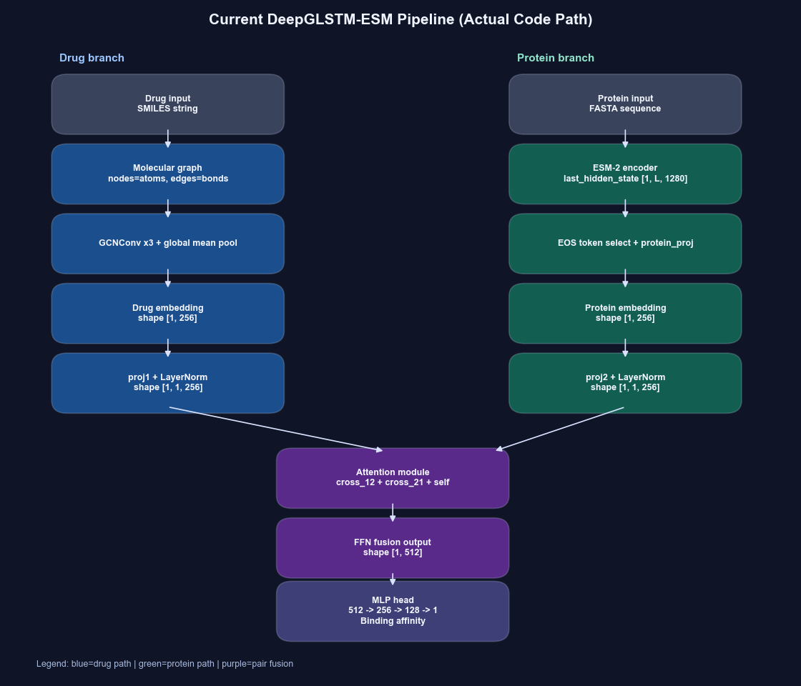

# DeepGLSTM: Deep Graph Convolutional Network and Transformer-based Approach for Predicting Drug-Target Binding Affinity

DeepGLSTM is an end-to-end deep learning framework designed to predict the binding affinity between drugs (small molecules) and target proteins. Originally developed using GCNs and LSTMs to aid drug repurposing for SARS-CoV-2, the project has evolved to include state-of-the-art transformer models and attention mechanisms.

## Project Overview

Our framework bridges structural topology and evolutionary sequence data to accurately score drug-target pairs. The codebase seamlessly integrates foundational research with modern architectural upgrades:

- **Graph-Based Drug Encoding:** We use Graph Convolutional Networks (GCN) to extract rich molecular features from the 2D topological graph of the drug.
- **Advanced Sequence Modeling:** While our foundational work utilized Long Short-Term Memory (LSTM) networks to encode proteins, our newly extended framework leverages **ESM-2** (Evolutionary Scale Modeling, `esm2_t33_650M_UR50D`), a massive protein language model that inherently captures tertiary structural dynamics and interaction pockets from the raw sequence.
- **Dynamic Feature Fusion via Attention:** Moving beyond simple vector concatenation, we implemented **Multi-Head Attention modules** (`self`, `cross`, and `both` configurations). Cross-attention mathematically aligns specific structural properties of the drug vector with key sites on the target protein vector, leading to significantly more adaptive learning.
- **Interactive Visualizations:** We built a web-based **Gradio Dashboard** (`demo.py`) that visually unpacks the model pipeline. It generates dynamic heatmaps of the Query/Key/Value steps within the cross-attention layer to explain exactly *how* the model scores specific pairs.

## Model Architectures

The framework gives you the flexibility to train and run inference on both the modern transformer extension and the classic baseline.

### Extended ESM-2 + GCN Architecture (New Work)
To improve performance and incorporate rich biological context, we integrated the pre-trained ESM-2 protein language model and replaced rigid concatenation with a Multi-Head Attention module.

The modern data flow explicitly models the physical interaction between molecule and protein:
- **Drug Branch:** Molecular Graph -> GCN Layers -> Global Mean Pool -> Attention Projection
- **Protein Branch:** FASTA Sequence -> ESM-2 Model -> EOS Token Extraction -> Attention Projection
- **Fusion Layer:** Multi-Head Attention (`cross` and `self`) dynamically weighs the combined features before passing them to the final dense MLP layers for affinity scoring.

### Original DeepGLSTM Structure
The original baseline framework relies purely on Graph Convolutions for the molecule and LSTMs with simple vector concatenation for the protein representation.

For more details on the foundational methodology, please read the [original publication](https://arxiv.org/pdf/2201.06872v1.pdf).

---

## Getting Started and Usage

The codebase is engineered to be highly flexible, allowing you to easily switch between modeling techniques.

For complete instructions on:
- **Environment setup** (PyTorch, PyG, RDKit, Transformers)
- **Dataset generation** (Processing Davis, KIBA, etc., into `.pt` files)
- **Training pipelines & Ablation Studies** (Running subsets, automated scripts)
- **Running the Interactive Attention Dashboard**

**[Please Refer to instructions.md](instructions.md)**

---

## Datasets

The framework has been evaluated on multiple drug-target interaction datasets. Below are the download links for the raw datasets.

### Dataset Downloads
| Dataset | Dataset Download Links |
| :--- | :--- |
| **Davis** | [Google Drive Link](https://drive.google.com/drive/folders/1IDDOEAeBz3DiVWuwPDbGBm3-zJoY5S5L?usp=share_link) |
| **KIBA** | [Google Drive Link](https://drive.google.com/drive/folders/1LPPhV2RNhADE0rC5OKkHLluGD-T4yFUS?usp=share_link) |
| **DTC** | [Google Drive Link](https://drive.google.com/drive/folders/12iB06YOTsF7NTMhOcaF0f11jTjgmGJ9O?usp=share_link) |
| **Metz** | [Google Drive Link](https://drive.google.com/drive/folders/1_JNDEfFO8DFfyvVX633mv2mj43CG7Pnj?usp=share_link) |
| **ToxCast** | [Google Drive Link](https://drive.google.com/drive/folders/1PcFlVYdq4EJuHAF8vG7x2FntrPNHt69m?usp=share_link) |
| **STITCH** | [Google Drive Link](https://drive.google.com/drive/folders/1F4sRWS9k4bbs3sDf_bPpxiCnpYcTeSXf?usp=share_link) |

> *Note:* Store downloaded datasets in the `data/` folder. Each link contains a `_train.csv` and `_test.csv` file.